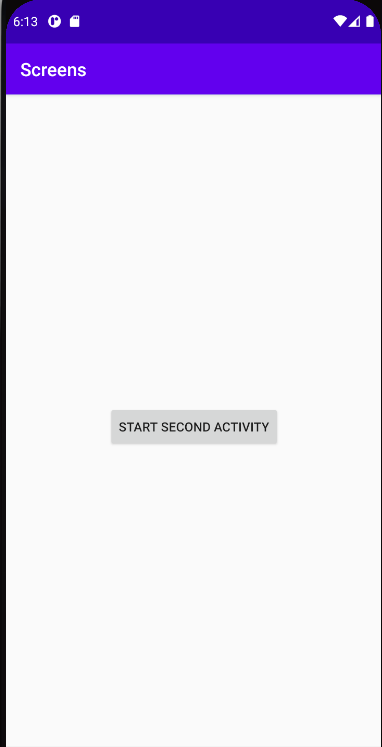
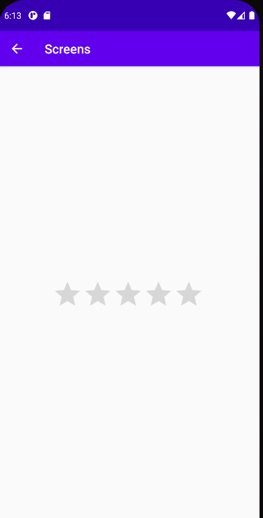

# Report
## Adding the secondary activity
To display a new activity we first need to create it. Android studio can
auto generate all the required components by right clicking layout and
navigating to ```New->Activity->Empty Activity```. This will create a
new java class in ```com.example.screens.ui.main```, a new xml file in
```res/layout``` and will add the activity to the
```AndroidManifest.xml``` file.

AndroidManifest.xml
```xml
<?xml version="1.0" encoding="utf-8"?>
<manifest xmlns:android="http://schemas.android.com/apk/res/android"
    package="com.example.screens">

    <application
        android:allowBackup="true"
        android:icon="@mipmap/ic_launcher"
        android:label="@string/app_name"
        android:roundIcon="@mipmap/ic_launcher_round"
        android:supportsRtl="true"
        android:theme="@style/AppTheme">
        <activity android:name=".Second"></activity>
        <activity android:name=".MainActivity">
            <intent-filter>
                <action android:name="android.intent.action.MAIN" />

                <category android:name="android.intent.category.LAUNCHER" />
            </intent-filter>
        </activity>
    </application>

</manifest>
```
activity_second.xml
```xml
<?xml version="1.0" encoding="utf-8"?>
<androidx.constraintlayout.widget.ConstraintLayout xmlns:android="http://schemas.android.com/apk/res/android"
    xmlns:app="http://schemas.android.com/apk/res-auto"
    xmlns:tools="http://schemas.android.com/tools"
    android:layout_width="match_parent"
    android:layout_height="match_parent"
    tools:context=".Second">
</androidx.constraintlayout.widget.ConstraintLayout>
```
Second.java
```java
package com.example.screens;

import androidx.appcompat.app.AppCompatActivity;

import android.os.Bundle;

public class Second extends AppCompatActivity {

    @Override
    protected void onCreate(Bundle savedInstanceState) {
        super.onCreate(savedInstanceState);
        setContentView(R.layout.activity_second);
    }
}
```

## Navigating to the second activity
Now we have to implement a process for navigating to the second
activity. In this app we'll simply use a button that switches to it. To
do this we first have to add a button to the main activity, we'll use
the designer to do this.

```xml
<?xml version="1.0" encoding="utf-8"?>
<androidx.constraintlayout.widget.ConstraintLayout xmlns:android="http://schemas.android.com/apk/res/android"
    xmlns:app="http://schemas.android.com/apk/res-auto"
    xmlns:tools="http://schemas.android.com/tools"
    android:layout_width="match_parent"
    android:layout_height="match_parent"
    tools:context=".MainActivity">

    <Button
        android:id="@+id/startButton"
        android:layout_width="wrap_content"
        android:layout_height="wrap_content"
        android:layout_marginStart="112dp"
        android:layout_marginLeft="112dp"
        android:layout_marginTop="340dp"
        android:text="Start Second activity"
        app:layout_constraintStart_toStartOf="parent"
        app:layout_constraintTop_toTopOf="parent" />

</androidx.constraintlayout.widget.ConstraintLayout>
```
We then need to write the logic that switches to the new activity. We'll
implement a new function in ```MainActivity.java```.

```java
    /** Called when the user taps the open button */
    public void openActivity(View view) {
        Intent intent = new Intent(this, Second.class);
        startActivity(intent);
    }
```
This function passes an Intent object to the startActivity function,
this Intent object tells the startActivity funtion what class started
the activity ("this" here) and what class the new activity is a part of
("Second.class" here).

We then tell the button to run this function when it's clicked by adding
a ```onClick``` attribute to it.

```xml
    <Button
        android:id="@+id/startButton"
        android:layout_width="wrap_content"
        android:layout_height="wrap_content"
        android:layout_marginStart="112dp"
        android:layout_marginLeft="112dp"
        android:layout_marginTop="340dp"
        
        android:onClick="openActivity"
        
        android:text="Start Second activity"
        app:layout_constraintStart_toStartOf="parent"
        app:layout_constraintTop_toTopOf="parent" />
```
## Creating the fragment
We will now create a fragment to add to the second activity. I needed to
add the dependency to the ```build.gradle``` file before the IDE would
recognize it.

```xml
dependencies {
    implementation fileTree(dir: 'libs', include: ['*.jar'])
    def fragment_version = "1.3.3"
    implementation "androidx.fragment:fragment:$fragment_version"
    
    implementation 'androidx.appcompat:appcompat:1.1.0'
    implementation 'androidx.constraintlayout:constraintlayout:1.1.3'
    implementation 'androidx.lifecycle:lifecycle-livedata-ktx:2.2.0'
    implementation 'androidx.lifecycle:lifecycle-viewmodel-ktx:2.2.0'
    implementation 'com.google.android.material:material:1.3.0'
    implementation 'androidx.legacy:legacy-support-v4:1.0.0'
    testImplementation 'junit:junit:4.12'
    androidTestImplementation 'androidx.test.ext:junit:1.1.1'
    androidTestImplementation 'androidx.test.espresso:espresso-core:3.2.0'
}
```
We can now add the fragment to the app by right clicking layout and
navigating to ```New->Fragment->Fragment (Blank)```. This will create a
couple of files, ```fragment_second_fragment.xml``` in layouts as well
as a lengthy .java file. Since we won't be changing the .java file I
won't include it here for brevity's sake. I'll also add a widget to the
fragment in this step.

```xml
<?xml version="1.0" encoding="utf-8"?>
<FrameLayout xmlns:android="http://schemas.android.com/apk/res/android"
    xmlns:app="http://schemas.android.com/apk/res-auto"
    xmlns:tools="http://schemas.android.com/tools"
    android:layout_width="match_parent"
    android:layout_height="match_parent"
    tools:context=".ui.main.second_fragment">

    <androidx.constraintlayout.widget.ConstraintLayout
        android:layout_width="match_parent"
        android:layout_height="match_parent">

        <RatingBar
            android:id="@+id/ratingBar2"
            android:layout_width="wrap_content"
            android:layout_height="wrap_content"
            android:layout_marginStart="84dp"
            android:layout_marginLeft="84dp"
            android:layout_marginTop="336dp"
            app:layout_constraintStart_toStartOf="parent"
            app:layout_constraintTop_toTopOf="parent" />

    </androidx.constraintlayout.widget.ConstraintLayout>
</FrameLayout>

```
## Adding the fragment to the second activity
We now want to add the fragment to the activity to display it when the
activity is loaded. We'll do this by adding a
```FragmentContainerView``` to it and specify the previously created
fragment in it. This is done with the ```android:name``` attribute.

```xml
    <androidx.fragment.app.FragmentContainerView
        android:id="@+id/fragment_container_view"
        android:name="com.example.screens.ui.main.second_fragment"
        android:layout_width="match_parent"
        android:layout_height="match_parent"
        app:layout_constraintStart_toStartOf="parent"
        app:layout_constraintTop_toTopOf="parent" />
```

This means that the fragment will be create a view and send it to the
FragmentContainerView when the second activity is opened.

## Adding upward navigation
If we want our user to be able to leave the second activity and get back
to the main activity we need to specify the logical parent for the
second activity. This is done in the ```AndroidManifest.xml``` file. To
increase the compatibility of this we'll use both the new and old way of
doing this. When the second activity is opened now, a back arrow will be
auto generated that allows the user to navigate back to the main
activity.

```xml
        <activity android:name=".Second">
            android:parentActivityName=".MainActivity">
            <!-- The meta-data tag is required if you support API level 15 and lower -->
            <meta-data
                android:name="android.support.PARENT_ACTIVITY"
                android:value=".MainActivity" />
        </activity>
```
## Screenshots
### Main activity

### Second activity
